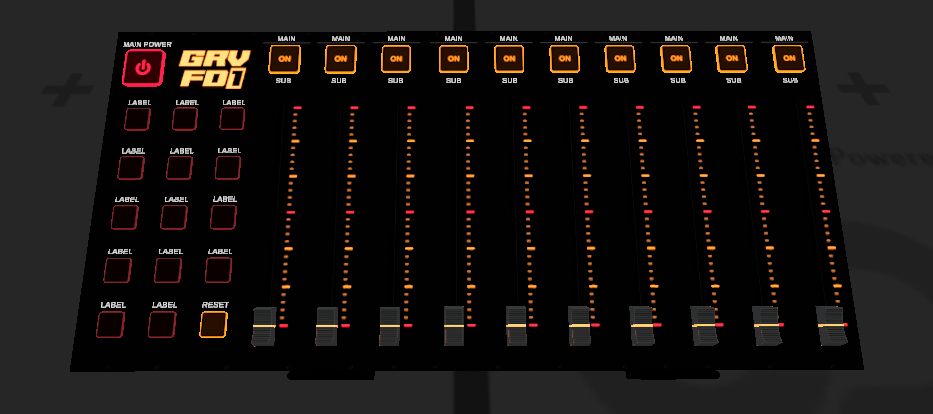
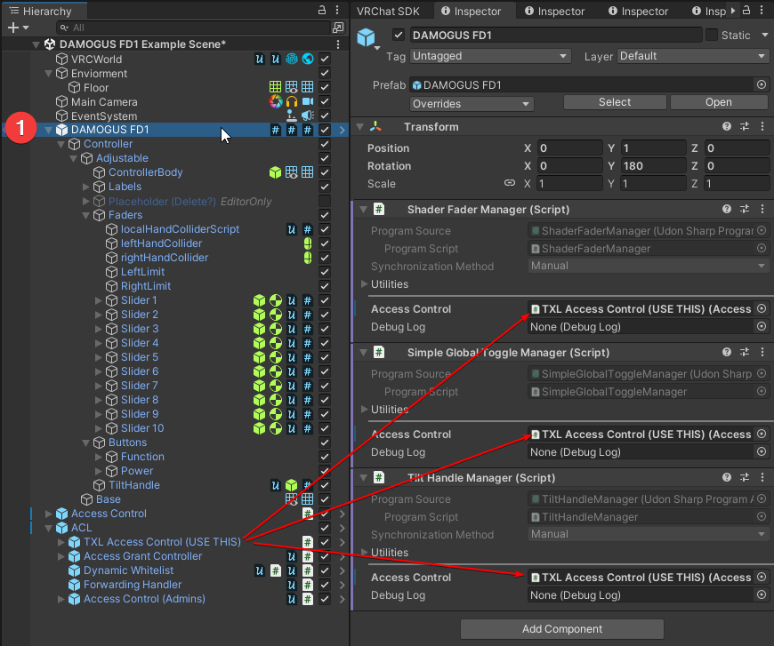
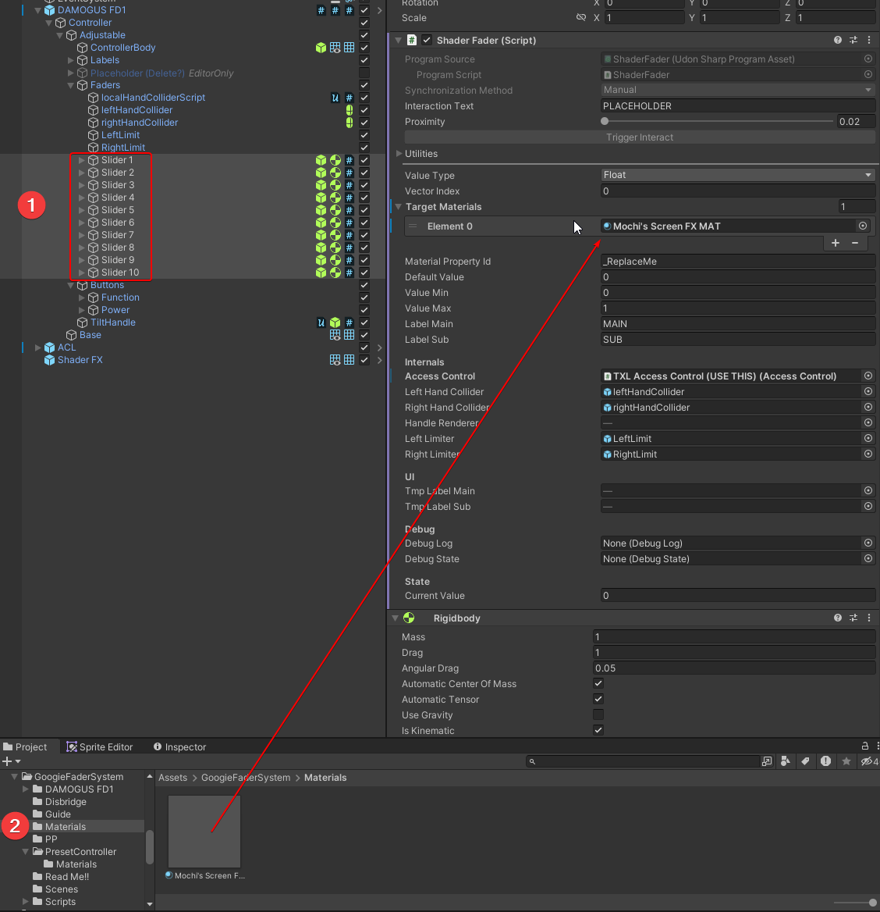
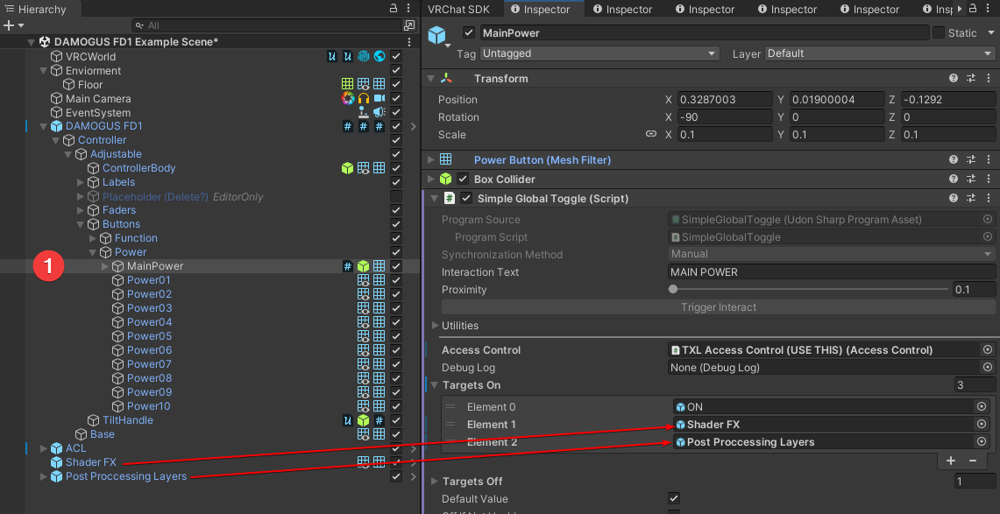
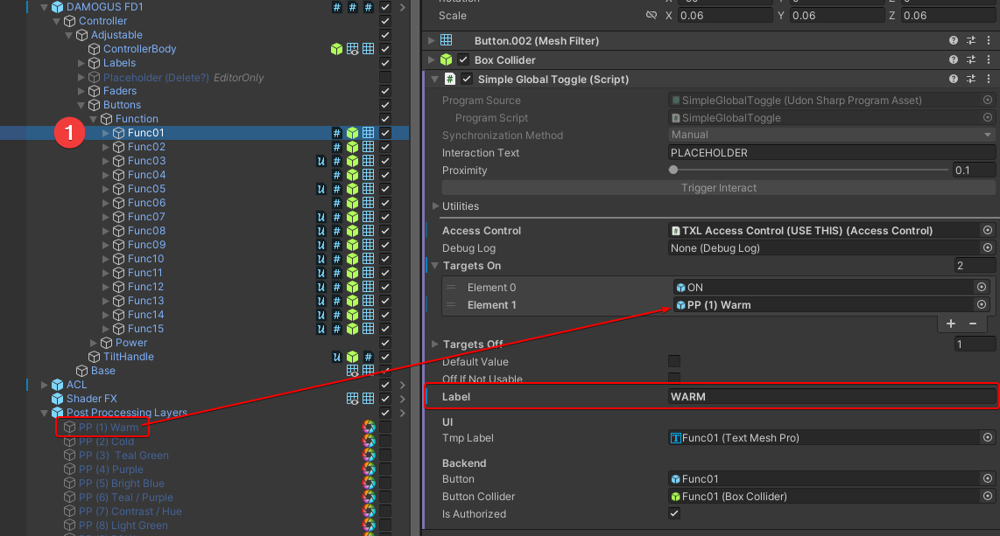

# GoogieFaderSystem

## Installation

go to Releases to find a a unitypackage

### Dependencies

- https://vrctxl.github.io/VPM/ 
  - AccessTXL 
  - MiscTXL
  - CommonTXL (dependency of the rest)
- https://github.com/MochiesCode/Mochies-Unity-Shaders  
  preferrably the partreon variant (materials might break without)

## Setup

### From Sample

1. go to GoogieFaderSystem and drag `FaderSystem Sample.prefab` into your scene or hierarchy
2. it is recommended to unpack this
4. DONE, continue with [Prefabs](#prefabs) below

### 0. DAMOGUS FD 1

localtion: `DAMOGUS FD1/DAMOGUS FD1.prefab`
drag it into your scene or hierachy and adjust location

Setup

### 1. Install TXL Access Controler 

this is **REQUIRED** without ACL setup none of the buttons or faders will do anything

a exammle setup with a Grant UI is provided in `ACL.prefab`

for more documentation visit https://github.com/vrctxl/VideoTXL/wiki/Access-Control-(ACL)

### 2. Setup `ShaderFX`  

add `ShaderFX.prefab` to the scene, or use a existing one  
**you should not have multiple Mochie Screen FX overlapping**

this also requires at least **ONE** Realtime Light
if your scene needs one you can find the `DepthLight.prefab` and drag it into the scene

multi select all faders and drag the `Mochie's Screen FX` into the tharget material slot  

### 3. Setup Screen FX properties on faders

now you can go through **ALL** the faders and update their 
 - material property id
 - default value
 - minimum value
 - maximum value
 - main label
 - sub label

Note: the `TextMeshPro` Label content is automatically updated in editor  
the Interaction text is set to the label text at runtime  

### 4. Add `Post Processing Layers.prefab`

or bring your own post processing layers

### 5. Setup Power Button 

Add the `ShaderFX` and `Post Processing Layers`to `Targets ON` on `Buttons/Power/MainPower`

### 6. Setup PostProcessing function buttons

Repeat this for `Func01` - `Func14`, but **NOT** `Func15`  

drag the chosen Post Processing effect into the second slot in `Targets On`  
update the `Label`  
this will also update the TextmeshPro Label and affect the Interaction Text at runtime

## VCC

- TODO: investigate how to host a vcc repo on github pages or such

## development

clone this project into the Assets directory of a project
